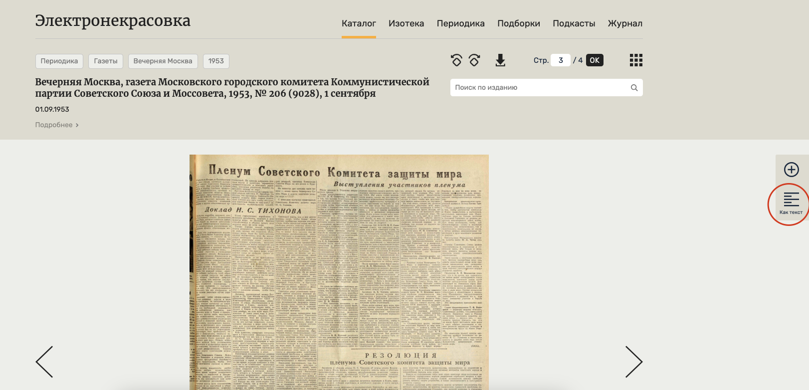

# Description

Parser allows to extract some data about the cinema schedule from the [electro.nekrasovka.ru](https://electro.nekrasovka.ru/editions/1/1953/9?page=1) website for the newspaper "Вечерняя Москва" (Evening Moscow).

An example of the page that can be parsed is [here](https://electro.nekrasovka.ru/books/6173751/pages/4). Notice, that it is a concrete newspaper release on its **4th page** where the daily cinema schedule usually resides.

The script extracts text of the page scan available under the "Как текст" button:



## Threat of validity

The page scans available on the website **may NOT** reflect the actual content of the image in full, due to likely being automatically parsed from the image. Artifacts, misspelled text, and missing text excerpts occasionally occur. Therefore, this script **should NOT** be treated as a full-fledged one-click parsing solution but rather as a helping facility; **manual afford and proof-reading encouraged**.

The implementation is crafted for the website version available on **7 Nov 2024**. Newer website versions may have different layouts, thus, the solution may not work as intended.


# Instructions

## Requirements

1. Clone this repository and open its root folder in a code editor like [Visual Studio Code](https://code.visualstudio.com/) or in a terminal.

1. Install [python](https://www.python.org/downloads/) on your machine.

All the commands mentioned below should be run from a terminal/command line interface (CLI).

2. Conduct the dependencies installation:
```bash
# Windows
python -m venv ./venv # creates a virtual environment; avoids global dependency installation (recommended)
. ./venv/Scripts/activate # environment activation (NOTICE THE DOT IN FRONT!)
pip install ./requirements.txt # installation


# Mac/Unix
python3 -m venv ./venv
. ./venv/bin/activate # environment activation
# Note: once activated, use `python` and `pip` afterwards
#       instead of calling `python3` and `pip3`. This way,
#       you will use the executables within the just created
#       virtual environment, not the global counterparts.
pip install -r ./requirements.txt
```

## How to Use

### TLDR

**Reading the rest is recommended!**

```bash
make help # outputs help message; or use `python ./main.py --help`
make run # default run; or use `python ./main.py`

# custom run
python ./main.py --input_filepath=./path/to/input/file.json
# Note: see the JSON file schema below
```

---

### Help

Run `make help` or `python main.py --help` to see the help message of the program.


### Run

The program accepts the following parameters:

1. `input_filepath`: Path to the input **JSON file**; default is `./input.json`.

The format of this file should be as follows:
```json
{
    "urls": [
        "url1",
        "url2",
    ],
    "cinemas": [
        "cinema1",
        "cinema2",
    ]
}
```

For instance (a real example):
```json
{
    "urls": [
        "https://electro.nekrasovka.ru/books/6173751/pages/4",
        "https://electro.nekrasovka.ru/books/6173753/pages/4",
        "https://electro.nekrasovka.ru/books/6173755/pages/4",
    ],
    "cinemas": [
        "Метрополь", // uppercase starting letters are REQUIRED! Currently, the solution is case-sensetive.
        "Ударник",
        "Орион"
    ]
}
```

Keep close attention to the URLs you provide: They should navigate to the **4th page of a particular newspaper release**. Open a link in the example about to better get the context.

2. Run with the default values (**expects a `input.json` file to be at the root folder**):
```bash
make run
# or
python ./main.py
```

3. Run with custom arguments:
```bash
python ./main.py --input_filepath=./path/to/my/input.json
```

Once the run succeeds you will see several artifacts generated:

1. `script.log`: The log file with the information about the execution (should be user-friendly enough).

2. `artifacts/`: The folder where the artifacts are located.
    1. `artifacts/result.csv`: A CSV file with the format of `cinema,date,title_excerpt,url`:
        1. `cinema`:
        1. `date`: The date this entry corresponds to (it is parsed from the webpage).
        1. `title_excerpt`: This is a text excerpt **BEFORE** the occurance of the `cinema` under consideration (including the `cinema` itself). This `excerpt` is supposed to contain a name of a movie in the schedule.
        1. `url`: The URL a website of which was parsed in this entry.
    1. `artifacts/urls`: A folder that contains the contents of the webpages sorted by the corresponding dates. Each date folder contains two files: 1) `full-content.html` is the actual content of the webpage; 2) `text-content.txt` the text that corresponds to the textual representation of the newspaper release.

Example of the output within `result.csv` (excerpt length was 120 symbols before the cinema name):
```csv
cinema,date,title_excerpt,url
Метрополь,01.09.1953,"в $ ч. 30 м. вечера. Билеты продаются. 	sCOBETCHHH СПОРТ» № 8 — хроника, Новости вня, Наука и знание.  «АРЕНА СМЕЛЫХ» — Метрополь",https://electro.nekrasovka.ru/books/6173751/pages/4
Ударник,01.09.1953,"» №№ АГ и 452 — Хроника, Науна и знание, Нинозал короткометражно- го фильма, Нозости дня.  <ПАРМСКАЯ ОБНТЕЛЬ» (i-n а — 	Ударник",https://electro.nekrasovka.ru/books/6173751/pages/4
Метрополь,02.09.1953,"и знание, Кинозал короткометражно- го фильма, Новости дня;  «ПАРМСКАЯ ОБИТЕЛЬ» (1-я серия) — Ударник, Театр ниноактера, Метро- поль",https://electro.nekrasovka.ru/books/6173753/pages/4
Орион,02.09.1953,"ой комиссии по перемирию 	«ИХ БЫЛО ПЯТЕРО» — Смена, Спар- тан. «Аквариум», Авангард. 	NE NE cara?  им. Моссовета, Уран, Орион",https://electro.nekrasovka.ru/books/6173753/pages/4
Метрополь,03.09.1953,"и знание, Кинозал коротнометражно- го фильма, Новости BHA.  «ПАРМСНАЯ ОБИТЕЛЬ» (1-я серия) — Ударник, Театр киноактера, Метро- поль",https://electro.nekrasovka.ru/books/6173755/pages/4
Метрополь,03.09.1953,", ПКиО «Сокольники», ЦПКиО им. Горького, сад им. Баумана, парн им. Дзержинского, Перексп, Форум, Линамо. 	«ЧУК И ГЕК» — Метрополь",https://electro.nekrasovka.ru/books/6173755/pages/4
Ударник,03.09.1953,"№ 42 и 43 — Хроника, Наука и знание, Кинозал коротнометражно- го фильма, Новости BHA.  «ПАРМСНАЯ ОБИТЕЛЬ» (1-я серия) — Ударник",https://electro.nekrasovka.ru/books/6173755/pages/4
Орион,03.09.1953," Ударник, Театр киноактера, Метро- поль, Художественный, Централь- ный, Москва, Таганский, Родина, им. Моссовета, Уран, Орион",https://electro.nekrasovka.ru/books/6173755/pages/4
```

### Directions

You are interested in the `results.csv` file. Once it is generated, you can either manually or via additional scripts (that _are NOT present by this solution_) conduct further analysis/data collection.

**Caution:** contents of `title_excerpt` may contain artifacts coming from the webpage; this is a _limitation of the source platform that is not possible to fix_. Therefore, **manually skimming through the image-formatted newspaper release of the website is recommented**.
